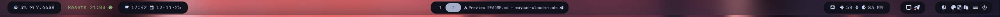

# waybar-claude-code

[](https://go.dev/dl/)
[]()

[](LICENSE)

A lightweight Waybar custom module that displays Claude Code usage metrics to your bar using [ccusage](https://github.com/ryoppippi/ccusage).

## Screenshots




> [!NOTE]
> Check out the [example configuration](examples/) for CSS and Waybar config samples.

## Features

- **Single static binary** - Pure Go compilation, no interpreters or runtime dependencies
- **Long-running daemon** - Efficient internal ticker, no process restart overhead
- **Configurable polling** - Tune `CLAUDE_INTERVAL_SEC` for custom refresh cycles
- **Minimal footprint** - <5 MB memory, near-zero idle CPU
- **Detailed metrics** - Tooltip shows requests, tokens, cost, and time until reset

## Requirements

- [npm/npx](https://nodejs.org/) - Required to run ccusage
- [Waybar](https://github.com/Alexays/Waybar) - For module integration
- [Nerd Fonts](https://www.nerdfonts.com/) - For icon display
- Go 1.21+ - For building from source

## Installation

**Download precompiled binary:**

```bash
curl -LO https://github.com/hxreborn/waybar-claude-code/releases/latest/download/waybar-claude-code
install -Dm755 waybar-claude-code ~/.config/waybar/modules/waybar-claude-code
```

**Build from source:**

```bash
git clone https://github.com/hxreborn/waybar-claude-code.git
cd waybar-claude-code
make install
```

## Configuration

Add to `~/.config/waybar/config.jsonc`:

```jsonc
{
  "modules-right": ["custom/claude-code"],

  "custom/claude-code": {
    "return-type": "json",
    "format": "{icon}",
    "format-icons": ["󰜡"],
    "exec": "~/.config/waybar/modules/waybar-claude-code",
    "tooltip": true
  }
}
```

### Environment Variables

| Variable | Default | Description |
|----------|---------|-------------|
| `CLAUDE_INTERVAL_SEC` | `300` | Poll interval in seconds |
| `CLAUDE_ANIMATE` | `false` | Show spinner instead of static icon |

## Usage

Hover over the module to see detailed metrics:

```
Requests: 42 | Tokens: 1.2M
Cost: $0.45 | Reset: 2h 15m
```

## License

MIT - see [LICENSE](LICENSE) file for details
